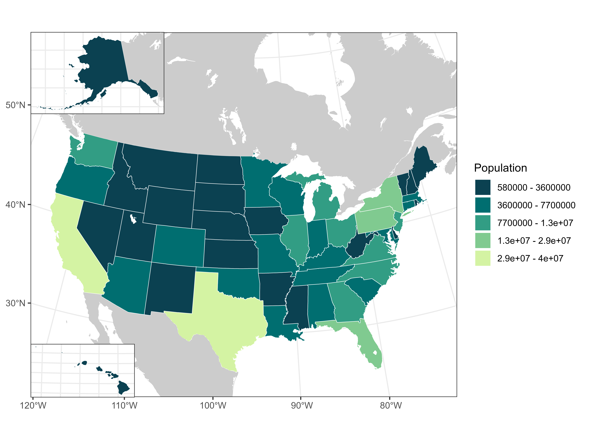

# Making Pretty Maps

Now that we've learned how to do some spatial analysis, you likely want to make a nice looking map to put in a manuscript or presentation.

*Note:* This workshop is currently a work in progress. All of the mapping elements are present, but the presentation and setup portion are yet to be added. I appreciate your patience as I finish this up in my free time.

```{r packages04}
library(sf)
library(tidyverse)
library(terra)
```

```{r echo = F}
sf::sf_use_s2(FALSE)
```


## USA Population 

```{r usa}
# Load the US population shapefile
usa <- st_read("Data/Visualization/US_states", quiet = T)
head(usa)

# plot to see what it looks like
ggplot(usa) +
  geom_sf()
```

```{r usaPop}
# Fill the states based on their population
ggplot(usa) +
  geom_sf(aes(fill = POP2020))
```
```{r can_mex}
# Add Canada and Mexico to the map
# Adds context for the US (isn't floating in some void but exists in the world)

library(maps)

can_mex <- maps::map("world", plot = F, fill = T) %>%
  st_as_sf() %>%
  st_transform(4326) %>%
  filter(ID %in% c("Canada", "Mexico")) 
ggplot(can_mex) +
  geom_sf()
```
```{r naPop}
ggplot(usa) +
  # make the outline around the states white
  geom_sf(aes(fill = POP2020), col = "white") +
  # remove the outline around Canada and Mexico and grey them out
  # (focuses the eye towards what's important about this map ie US population)
  geom_sf(data = can_mex, col = NA, fill = "grey80")
```
```{r naPopLakes}
# Add North American lakes to the map

lakes <- maps::map("lakes", plot = F, fill = T) %>%
  st_as_sf() %>%
  st_transform(4326)
st_bbox(bind_rows(usa, can_mex))
na_lakes <- lakes %>%
  st_crop(st_bbox(bind_rows(usa, can_mex)))
ggplot(na_lakes) +
  geom_sf()

ggplot(usa) +
  geom_sf(aes(fill = POP2020), col = "white") +
  geom_sf(data = can_mex, col = NA, fill = "grey80") +
  geom_sf(data = na_lakes, fill = "white", col = NA) +
  theme_bw()
```
```{r contig}
# Filter out Alaska and Hawaii to create just the contiguous USA polygons
contig_usa <- usa %>%
  filter(!STATE %in% c("Alaska", "Hawaii"))
ggplot(contig_usa) +
  geom_sf()
```
```{r contigAlbers}
# Project the contiguous USA to Conus Albers (EPSG:6350)
# Standard projection for US maps
contig_usa <- st_transform(contig_usa, 6350) 
ggplot(contig_usa) +
  geom_sf()
```
```{r contigPop}
# Project Canada, Mexico, and the lakes to Conus Albers and add to the map
can_mex <- st_transform(can_mex, 6350)
lakes <- st_transform(lakes, 6350)
ggplot(contig_usa) +
  geom_sf(aes(fill = POP2020), col = "white") +
  geom_sf(data = can_mex, col = NA, fill = "grey80") +
  geom_sf(data = na_lakes, fill = "white", col = NA) +
  theme_bw()
```
```{r zoomContigPop}
# Zoom the view window to just the contiguous USA
st_bbox(contig_usa)

us_plot <- ggplot(contig_usa) +
  geom_sf(aes(fill = POP2020), col = "white") +
  geom_sf(data = can_mex, col = NA, fill = "grey80") +
  geom_sf(data = na_lakes, fill = "white", col = NA) +
  theme_bw() +
  xlim(c(st_bbox(contig_usa)["xmin"], st_bbox(contig_usa)["xmax"])) +
  ylim(c(st_bbox(contig_usa)["ymin"] - 1e5, st_bbox(contig_usa)["ymax"] + 1e6)) 
us_plot
```

```{r alaska}
# Filter to create an Alaska and a Hawaii polygon
# We'll add these to the map as inset maps
alaska <- filter(usa, STATE == "Alaska")
alaska <- st_transform(alaska, 3338)

ak_plot <- ggplot(alaska) +
  geom_sf(aes(fill = POP2020), col = "white") +
  geom_sf(data = can_mex, col = NA, fill = "grey80") +
  geom_sf(data = na_lakes, fill = "white", col = NA) +
  theme_bw() +
  xlim(c(st_bbox(alaska)["xmin"], st_bbox(alaska)["xmax"])) +
  ylim(c(st_bbox(alaska)["ymin"], st_bbox(alaska)["ymax"])) +
  coord_sf(datum = 3338) 
ak_plot
```

```{r hawaii}
hawaii <- usa %>%
  filter(STATE == "Hawaii") %>%
  st_transform(st_crs("ESRI:102007"))

hi_plot <- ggplot(hawaii) +
  geom_sf(aes(fill = POP2020), col = "white") +
  theme_bw() +
  xlim(c(st_bbox(hawaii)["xmin"], st_bbox(hawaii)["xmax"])) +
  ylim(c(st_bbox(hawaii)["ymin"], st_bbox(hawaii)["ymax"])) 
hi_plot
```

```{r cowplot}
# Use the library 'cowplot' to add figures on top of other figures
library(cowplot)
```

```{r panels}
# 'ggdraw' is cowplot's version of 'ggplot'
# 'draw_plot' is cowplot's version of 'geom_sf'

ggdraw() +
  draw_plot(us_plot) +
  # the x and y arguments tell cowplot where these figures should go on
  #   the map (based on, I beleive, the bottom left corner)
  #   The units are in pixels from 0 (bottom/left) to 1 (top/right)
  # The 'height' argument tells cowplot how big/small this figure should be
  # NOTE: these values are very subjective to your plotting window. If you 
  #   are saving this as a picture file, be sure to check frequently that it looks
  #   right, because it will likely look different than in your plotting window 
  #   in R studio
  draw_plot(ak_plot, x = 0.035, y = 0.75, width = 0.25, height = 0.25) +
  draw_plot(hi_plot, x = 0.035, y = 0.015, width = 0.25, height = 0.25)

# Right now this doesn't look good. We'll need to remove the legend from the 
# Alaska and Hawaii maps. But we also want to be sure that AK and HI's population
# is shown visually on the same scale as the contiguous US (right now they're)
# on their own scales, so the color shown is mis-representing the population

```

```{r popBreaks}
# Let's bin the US populations in a way that makes more sense to look at 
# 'BAMMtools' has a function for Jenks Breaks, which is a standard way to bin
#   continuous values
library(BAMMtools)
(pop_breaks <- getJenksBreaks(var = usa$POP2020, k = 6))
(pop_breaks <- signif(pop_breaks, 2))
```
```{r popCat}
# Add a flag for each state to mark which population bin it should go in
usa <- usa %>%
  mutate(POP2020_BREAKS = case_when(
    POP2020 >= min(POP2020) & POP2020 < pop_breaks[2] ~ "1",
    POP2020 >= pop_breaks[2] & POP2020 < pop_breaks[3] ~ "2",
    POP2020 >= pop_breaks[3] & POP2020 < pop_breaks[4] ~ "3",
    POP2020 >= pop_breaks[4] & POP2020 < pop_breaks[5] ~ "4",
    POP2020 >= pop_breaks[5] & POP2020 <= max(POP2020) ~ "5")) 

# Now we've binned population into categories
ggplot(usa) +
  geom_sf(aes(fill = POP2020_BREAKS)) 
```

```{r hclPals}
# The base color palette can be a little ugly
# hcl.pals() gives you a list of pre-made palettes, but you could also
# make your own
hcl.pals()
```

```{r emrld}
# We'll use the palette 'Emrld' (but you could pick any you like)
pop_cols <- hcl.colors(5, palette = "Emrld")
ggplot(usa) +
  geom_sf(aes(fill = POP2020_BREAKS)) +
  scale_fill_manual(values = pop_cols,
                    labels = c(paste(pop_breaks[1], "-", pop_breaks[2]),
                               paste(pop_breaks[2], "-", pop_breaks[3]),
                               paste(pop_breaks[3], "-", pop_breaks[4]),
                               paste(pop_breaks[4], "-", pop_breaks[5]),
                               paste(pop_breaks[5], "-", pop_breaks[6])))
```

```{r popBreaksLab}
# Let's make the legend label into an object so we don't have to copy-paste
# this everytime we need to plot
pop_breaks_labs <- c(paste(pop_breaks[1], "-", pop_breaks[2]),
                     paste(pop_breaks[2], "-", pop_breaks[3]),
                     paste(pop_breaks[3], "-", pop_breaks[4]),
                     paste(pop_breaks[4], "-", pop_breaks[5]),
                     paste(pop_breaks[5], "-", pop_breaks[6]))
```


```{r contigPopMap}
# Let's make the map of the contiguous US as before
# (we need to re-make teh contig_usa object since it doesn't have the population
# breaks attributes)
contig_usa <- usa %>%
  filter(!STATE %in% c("Alaska", "Hawaii")) %>%
  st_transform(6350)
us_pop_plot <- ggplot() +
  geom_sf(aes(fill = POP2020_BREAKS), col = "white",
          data = contig_usa) +
  geom_sf(data = can_mex, col = NA, fill = "grey80") +
  geom_sf(data = na_lakes, fill = "white", col = NA) +
  theme_bw() +
  xlim(c(st_bbox(contig_usa)["xmin"], st_bbox(contig_usa)["xmax"])) +
  ylim(c(st_bbox(contig_usa)["ymin"] - 1e5, st_bbox(contig_usa)["ymax"] + 1e6)) +
  scale_fill_manual(values = pop_cols,
                    labels = pop_breaks_labs) 
us_pop_plot
```

```{r akPop}
# Let's also remake the AK and HI inset maps
# (AK and HI need to be re-made because they don't have the population breaks
# attributes)
alaska <- usa %>%
  filter(STATE == "Alaska") %>%
  bind_rows(data.frame(POP2020_BREAKS = as.character(1:5))) %>%
  st_transform(3338)
ak_pop_plot <-  ggplot() +
  geom_sf(aes(fill = POP2020_BREAKS), col = "white",
          data = alaska) +
  geom_sf(data = can_mex, col = NA, fill = "grey80") +
  geom_sf(data = na_lakes, fill = "white", col = NA) +
  theme_bw() +
  xlim(c(st_bbox(alaska)["xmin"], st_bbox(alaska)["xmax"])) +
  ylim(c(st_bbox(alaska)["ymin"], st_bbox(alaska)["ymax"])) +
  coord_sf(datum = 3338)  +
  scale_fill_manual(values = pop_cols,
                    labels = pop_breaks_labs)
ak_pop_plot
```

```{r hiPop}
hawaii <- usa %>%
  filter(STATE == "Hawaii") %>%
  st_transform(st_crs("ESRI:102007")) %>%
  bind_rows(data.frame(POP2020_BREAKS = as.character(1:5)))
hi_pop_plot <-  ggplot() +
  geom_sf(aes(fill = POP2020_BREAKS), col = "white",
          data = hawaii) +
  theme_bw() +
  xlim(c(st_bbox(hawaii)["xmin"], st_bbox(hawaii)["xmax"])) +
  ylim(c(st_bbox(hawaii)["ymin"], st_bbox(hawaii)["ymax"]))   +
  scale_fill_manual(values = pop_cols,
                    labels = pop_breaks_labs)
hi_pop_plot
```

```{r popMap}
# Now add everything together
us_pop_map <- ggdraw() +
  draw_plot(us_pop_plot + labs(fill = "Population")) +
  # legend.position = 'none' removes the legend
  draw_plot(ak_pop_plot + theme(legend.position = 'none',
                                axis.text = element_blank(),
                                axis.ticks = element_blank(),
                                plot.background = element_blank()), 
           x = 0.0375, y = 0.707, width = 0.25, height = 0.25) +
  draw_plot(hi_pop_plot + theme(legend.position = 'none',
                                axis.text = element_blank(),
                                axis.ticks = element_blank(),
                                plot.background = element_blank()),
            x = 0.0375, y = 0.0351, width = 0.2, height = 0.25)
```

```{r saveImageQuiet, echo = F}
plot_dir <- "Plots"
if(!dir.exists(plot_dir)){dir.create(plot_dir)}
us_pop_map <- us_pop_map +
  theme(text = element_text(size = 6))       
ggsave("us_pop_map.png", us_pop_map, path = plot_dir, 
       width = 8, height = 6, units = "in", dpi = 900)
```

```{r showPlotFake, eval = F}

us_pop_map

# Reminder that the xy and width/height for cowplot plots are very subjective,
# So you'll have to check and adjust for your viewing window
```

```{r showRealPlot, fig.align = 'center', echo = F}

```

### Change in Population

For the last plot we visually showed the current US population with colors
We can also visually convey information through points and their size
For this plot, let's combine the two to create a map showwing the current US population and it's change from the last census count

```{r checkDf}
# Check the dataframe
head(usa)
# we have POP2020 and POP2010, so we can calculate the percent change in population
```
```{r popPercChange}
usa <- usa %>%
  mutate(pop_perc_change = ((POP2020 - POP2010)/POP2010) * 100)
summary(usa$pop_perc_change)

# Plot just to check what it looks like. Reminder that our final plot will 
# have the color-coded current population (the previous map) and the percent
# change in population represented by different size points
ggplot(usa) +
  geom_sf(aes(fill = pop_perc_change))
```
```{r centroid}
# Find the centeroid of each state for the point to fall on
state_center <- st_centroid(usa)
ggplot(usa) +
  geom_sf(data = usa) +
  geom_sf(data = state_center)
```
```{r percChangePoint}
# Show the percent change in population based on the point size
ggplot(usa) +
  geom_sf(data = usa) +
  geom_sf(data = state_center,
          aes(size = pop_perc_change))
```

```{r popChangeBreaks}
# Put the percent change into bins 
(pop_change_breaks <- getJenksBreaks(var = usa$pop_perc_change, k = 4))
```
```{r negPopChange}
# There are some negative percent change values (ie the population decreased)
# So let's filter out the negative changes
# (If a state had negative population growth, we will just mark that it was 
# less than 0)
pop_change_grtr_0 <- filter(usa, pop_perc_change > 0)$pop_perc_change
summary(pop_change_grtr_0)
(pop_change_breaks <- getJenksBreaks(var = pop_change_grtr_0, k = 4))
```
```{r binPopChange}
# Mark which bin the state should fall in based on its change in population
state_center <- state_center %>%
  mutate(pop_perc_change_breaks = case_when(
    pop_perc_change <= 0 ~ "1",
    pop_perc_change >= pop_change_breaks[1] & pop_perc_change < pop_change_breaks[2] ~ "2",
    pop_perc_change >= pop_change_breaks[2] & pop_perc_change < pop_change_breaks[3] ~ "3",
    pop_perc_change >= pop_change_breaks[3] & pop_perc_change <= pop_change_breaks[4] ~ "4"))
head(state_center)
```
```{r checkPopChange}
# Check map
ggplot(usa) +
  geom_sf(data = usa) +
  geom_sf(data = state_center,
          aes(size = pop_perc_change_breaks))
```

```{r pointSize}
# Let's manually adjust the sizes to be more clear how the sizes differentiate
ggplot(usa) +
  geom_sf(data = usa) +
  geom_sf(data = state_center,
          aes(size = pop_perc_change_breaks)) +
  scale_size_manual(values = seq(1, 8, by = 2))
```


```{r contigPointCenter}
# Now let's set up state_center like we did with the states themselves
# ie filter out AK and HI to make the contiguous USA and AK & HI into their own
# objects
contig_state_center <- state_center %>%
  filter(!STATE %in% c("Alaska", "Hawaii")) %>%
  st_transform(6350)

us_pop_plot +
  geom_sf(aes(size = pop_perc_change_breaks),
          data = contig_state_center) +
  scale_size_manual(values = seq(1, 8, by = 2)) 
```

```{r popChangeLabs}
# Make labels for the percent change legend
(pop_change_breaks_labs <- signif(pop_change_breaks, 1))
min(state_center$pop_perc_change)

(pop_change_labs <- c(paste0("-3% - ", pop_change_breaks_labs[1], "%"),
                      paste0(pop_change_breaks_labs[1], "% - ", pop_change_breaks_labs[2], "%"),
                      paste0(pop_change_breaks_labs[2], "% - ", pop_change_breaks_labs[3], "%"),
                      paste0(pop_change_breaks_labs[3], "% - ", pop_change_breaks_labs[4], "%")))
us_pop_change_plot <- us_pop_plot +
  geom_sf(aes(size = pop_perc_change_breaks),
          data = contig_state_center) +
  scale_size_manual(values = seq(0.5, 6, length.out = 4),
                    labels = pop_change_labs) 
us_pop_change_plot
```


```{r popChangeAK}
# Repeat for AK & HI
ak_center <- state_center %>%
  filter(STATE == "Alaska") %>%
  bind_rows(data.frame(pop_perc_change_breaks = as.character(1:4))) %>%
  st_transform(3338)

ak_pop_change_plot <- ak_pop_plot +
  geom_sf(aes(size = pop_perc_change_breaks),
          data = ak_center) +
  scale_size_manual(values = seq(1, 8, by = 2)) 
ak_pop_change_plot
```

```{r popChangeHI}
hi_center <- state_center %>%
 filter(STATE == "Hawaii") %>%
  bind_rows(data.frame(pop_perc_change_breaks = as.character(1:4))) %>%
  st_transform(st_crs("ESRI:102007"))

hi_pop_change_plot <- hi_pop_plot +
  geom_sf(aes(size = pop_perc_change_breaks),
          data = hi_center) +
  scale_size_manual(values = seq(1, 8, by = 2)) 

hi_pop_change_plot
```

```{r popChangeMap}
# Add everything together
us_pop_change_map <- ggdraw() +
  draw_plot(us_pop_change_plot + labs(fill = "Population",
                                      size = "Percent Population Change from 2010")) +
  draw_plot(ak_pop_change_plot + theme(legend.position = 'none',
                            axis.text = element_blank(),
                            axis.ticks = element_blank(),
                            plot.background = element_blank()), 
            x = 0.03, y = 0.65, width = 0.25, height = 0.25) +
  draw_plot(hi_pop_change_plot + theme(legend.position = 'none',
                            axis.text = element_blank(),
                            axis.ticks = element_blank(),
                            plot.background = element_blank()),
             x = 0.03, y = 0.089, width = 0.2, height = 0.25)
```

```{r savePopChangeQuiet, echo = F}
us_pop_change_map <- us_pop_change_map +
  theme(text = element_text(size = 6))       
ggsave("us_pop_change_map.png", us_pop_change_map, path = plot_dir, 
       width = 10, height = 8, units = "in", dpi = 1200)
```

```{r showPopChangeFake, eval = F}
us_pop_change_map
```

```{r showRealPopChange, fig.align = 'center', echo = F}
knitr::include_graphics("Plots/us_pop_change_map.png")
```

```{r rmUsPopElemnts, echo = F, warning = F, message = F}
# We can remove all of the objects from this section since we're done with them
# (we want to keep the objects 'contig_usa' and 'plot_dir' though)
rm(list = ls()[!(grepl("contig_usa", ls()) | 
                   grepl("plot_dir", ls()) | 
                   grepl("can_mex", ls())
                 )])
gc()
```


## Yellowstone

Let's make a map of species and their general distribution within Yellowstone

```{r YNP}
ynp <- st_read("Data/Visualization/Yellowstone", quiet = T) %>%
  # be sure it's projected to WGS 84 (EPSG:4326)
  st_transform(4326)

# Check that everything looks right
head(ynp)
plot(st_geometry(ynp))

# Load the GPS locations of four different species of wildlife in Yellowstone
ynp_animals <- read.csv("Data/Visualization/yellowstone_animals.csv")

ggplot() +
  geom_sf() +
  geom_sf(data = ynp) +
  # add the GPS points to the maps, color based on the species
  geom_point(aes(x = Longitude, y = Latitude, col = Species),
             data = ynp_animals)

```

```{r speciesRange}
# Load the ranges of the wildlife
range <- st_read("Data/Visualization/Species_Range", quiet = T)

# The attribute 'level' indicates more (smaller percentages) or less (higher percentages) intensely used spaces
head(range)

plot(st_geometry(range))
```
```{r rangeMap}
# Add the ranges to the yellowstone
ynp_plot <- ggplot() +
  # change the linetype to dotted
  geom_sf(data = ynp, linetype = 2, linewidth = 1) +
  # add the ranges to the map, fill color based on the intesnity of use
  geom_sf(aes(fill = Use), col = NA, alpha = 0.5,
          data = range) +
  geom_point(aes(x = Longitude, y = Latitude, col = Species),
             data = ynp_animals, alpha = 0.5) +
  # Give an outline to the points
  # (Note: this can also be done by changing the shape type to '21', 
  # which gives a point a fill and a color. 
  # The reason why I don't have that here is because the fill colors for the 
  # species ranges and points would be the same, and we want to give them 
  # different color palettes)
  geom_point(aes(x = Longitude, y = Latitude), data = ynp_animals, 
             shape = 21, col = "grey30", alpha = 0.5)
ynp_plot
```


```{r rangeMapFacet}
# Right now all the GPS points and ranges are on top of each other in one plot
# So it's difficult to see what's happening
ynp_plot <- ynp_plot +
  # facet_wrap creates different facets of the figure (in this case based on the species)
  facet_wrap(~Species, nrow = 2, ncol = 2)

ynp_plot
```

This plot is more clear. Let's change the colors of the species points

```{r animalPointCols}
# We'll use the palette "Green-Brown" for the animal points
animal_cols <- hcl.colors(n = 4, palette = "Green-Brown")
names(animal_cols) <- unique(ynp_animals$Species)
animal_cols

```

```{r ynpRangePalette}
ynp_plot <- ynp_plot +
  # We could pick another palette for the ranges, or we could use a built-in viridis palette
  scale_fill_viridis_c(option = "B") +
  scale_color_manual(values = animal_cols) +
  theme_bw()
ynp_plot
```

```{r xminmax}
# Finally, let's adjust the x-coordinate labels, since they're printing on top of each other
x_min <- signif(min(ynp_animals$Longitude), 3)
x_max <- signif(max(ynp_animals$Longitude), 3)
seq(x_min, x_max, by = 1)
```

```{r changeScaleX}
ynp_plot <- ynp_plot +
  scale_x_continuous(breaks = seq(x_min, x_max, by = 1)) +
  labs(x = "", y = "", fill = "Intensity of Use") 

ynp_plot 
```

### Hillshade

This plot is fine. But if we wanted, we could make the background a bit more interesting.
Let's add a hillshade, or an elevation raster that adds a shadow effect to look 3D

```{r dem}
# Load the DEM (Digital Elevation Model)
# We will derive everything from this raster to create the hillshade raster
ynp_dem <- rast("Data/Visualization/Yellowstone_DEM.tif")

# Check
ynp_dem
plot(ynp_dem)
plot(ynp$geometry, add = T)
```
```{r hillshade}
# To create a hillshade, we need both slope and aspect
# which can be derived using the function 'terrain'
ynp_slope <- terrain(ynp_dem, v = "slope", unit = "radians")
ynp_aspect <- terrain(ynp_dem, v = "aspect", unit = "radians")

# Now derive hillshade
ynp_hillshade <- shade(ynp_slope, ynp_aspect)
ynp_hillshade
plot(ynp_hillshade)
plot(ynp$geometry, add = T)
```
```{r rmTerrain, echo = F}
# We can remove these since we're done with them
rm(ynp_slope, ynp_aspect)
```


```{r hillshadeDF}
# We need to turn the raster into a dataframe so that ggplot can handle it
names(ynp_hillshade) <- "hillshade"
ynp_hill_df <- as.data.frame(ynp_hillshade, xy = T)
head(ynp_hill_df)

# Check
ggplot() +
  geom_raster(data = ynp_hill_df,
              aes(x = x, y = y, fill = hillshade))
```

When we plot the hillshade raster with other spatial objects, ggplot is able to tell that the raster is a spatial object too, and plots it with the correct projection


```{r plotHillshade}
ggplot() +
  geom_raster(data = ynp_hill_df,
              aes(x = x, y = y, fill = hillshade)) +
  geom_sf(data = ynp, linetype = 2, linewidth = 1, fill = NA) +
  scale_x_continuous(breaks = seq(x_min, x_max, by = 1))
```

Right now we can't see anything, so let's adjust the hillshade colors

```{r plotHillshadeGrey}
ynp_plot <- ggplot() +
  geom_raster(data = ynp_hill_df,
              aes(x = x, y = y, fill = hillshade),
              show.legend = FALSE) + # remove hillshade legend
  # Let's change the hillshade to a greyscale gradient
  scale_fill_gradient2("hillshade_lower_res",
                       low = "grey0", mid = "grey0", high = "grey100",
                       na.value = "transparent") +
  geom_sf(data = ynp, linetype = 2, linewidth = 1, fill = NA, col = "white") +
  scale_x_continuous(breaks = seq(x_min, x_max, by = 1))
ynp_plot
```

Neat!

Now let's add the animal data back to the map

```{r plotHillshadeAnimals}
 ynp_plot +
  geom_sf(aes(fill = Use), col = NA, alpha = 0.5,
          data = range) +
  geom_point(aes(x = Longitude, y = Latitude, col = Species),
             data = ynp_animals, alpha = 0.5) +
  geom_point(aes(x = Longitude, y = Latitude), data = ynp_animals, 
             shape = 21, col = "grey30", alpha = 0.5) +
  scale_fill_viridis_c(option = "B") +
  scale_color_manual(values = animal_cols) +
  facet_wrap(~Species, nrow = 2, ncol = 2) +
  theme_bw()
```

Oops, ggplot as a default can't handle more than one palette for 'fill' so it changed the hillshade to the same gradient as the animal ranges.

To fix this, we can use the package `ggnewscale`

```{r changeHillshadePalette}
library(ggnewscale)

 ynp_plot <- ynp_plot +
  new_scale("fill") + # let's you add a new fill scale
   geom_sf(aes(fill = Use), col = NA, alpha = 0.5,
          data = range) +
  geom_point(aes(x = Longitude, y = Latitude, col = Species),
             data = ynp_animals, alpha = 0.5) +
  geom_point(aes(x = Longitude, y = Latitude), data = ynp_animals, 
             shape = 21, col = "grey30", alpha = 0.5) +
  scale_fill_viridis_c(option = "B") +
  scale_color_manual(values = animal_cols) +
  facet_wrap(~Species, nrow = 2, ncol = 2) +
  theme_bw() +
  labs(x = "", y = "", fill = "Intensity of Use") 
 ynp_plot

```

Yay!

### Inset

Let's add an inset map so we know where in the US Yellowstone is located

```{r inset}
# Let's make a map of the contiguous US with Yellowstone
us_inset <- ggplot() +
  geom_sf(data = contig_usa, col = "white", fill = "grey") +
  geom_sf(data = ynp) +
  # this theme option voids out all backgrounds and labels
  theme_void()
us_inset
```

```{r insetCowplot}
# Cowplot both plots together
check_ynp <- ggdraw() +
  draw_plot(ynp_plot)  +
  draw_plot(us_inset, 
            x = 0.675, y = 0.05, width = 0.2, height = 0.2)
```

```{r saveCheckYNPQuiet, echo = F}
ggsave("check_ynp.png", check_ynp, path = plot_dir, 
       width = 10, height = 8, units = "in", dpi = 1200)
```

```{r showCheckYNPPlotFake, eval = F}
check_ynp
```

```{r showRealCheckYNPPlot, fig.align = 'center', echo = F}
knitr::include_graphics("Plots/check_ynp.png")
```

Right now, it's not immediately clear where Yellowstone is so let's make the outline red

```{r ynpRed, echo = F}
ggplot() +
  geom_sf(data = contig_usa) +
  geom_sf(data = ynp, col = "red", fill = NA, linewidth = 2)
```

This works fine, but maybe we want to make a red box around the general area where Yellowstone is located

```{r ynpBox, echo = F}
us_inset <- ynp %>%
  # pull Yellowstone's extent
  st_bbox() %>%
  # convert the extent into an sfc object
  st_as_sfc() %>%
  # add a small buffer
  st_buffer(0.5) %>% # measured in decimal degrees
  # Convert this NEW extent into an sfc object again
  st_bbox() %>%
  st_as_sfc() %>%
  # project to the same CRS as the contig_usa object
  st_transform(st_crs(contig_usa)) %>%
  # Plot
  ggplot() +
  geom_sf(data = contig_usa, col = "white", fill = "grey") +
  geom_sf(col = "red", fill = NA, linewidth = 1) +
  theme_void()
us_inset
```

```{r ynpInset}
# Now we have a map of yellowstone and where it's located
# (We could also adjust the inset map's location if needed)
ynp_map <- ggdraw() +
  draw_plot(ynp_plot)  +
  draw_plot(us_inset, 
            x = 0.675, y = 0.05, width = 0.2, height = 0.2)
```

```{r saveYNPQuiet, echo = F}
ggsave("ynp_map.png", ynp_map, path = plot_dir, 
       width = 10, height = 8, units = "in", dpi = 1200)
```

```{r showYNPPlotFake, eval = F}
ynp_map
```

```{r showRealYNPPlot, fig.align = 'center', echo = F}
knitr::include_graphics("Plots/ynp_map.png")
```

```{r rmYNPElemnts, echo = F, warning = F, message = F}
# We can remove all of the objects from this section since we're done with them
# (we want to keep the objects 'contig_usa' and 'plot_dir' though)
rm(list = ls()[!(grepl("contig_usa", ls()) | 
                   grepl("plot_dir", ls()) | 
                   grepl("can_mex", ls())
                 )])
gc()
```


## Landcover

Let's make a landcover map of the ecorgions in the Four Corners and adjust colors that make sense to the landcover type

```{r regions}
# Load the boundaries of different landcover types within the Four Corners
regions <- st_read("Data/Visualization/Landcover/Regions") %>%
  st_transform(st_crs(contig_usa))
regions

# add the land boundaries to the map and make it slightly transparent
ggplot() +
  geom_sf(data = contig_usa) +
  geom_sf(aes(fill = Region), alpha = 0.5,
          data = regions)
```
```{r fourCorners}
# Create a polygon of just the Four Corners region
corners_4 <- contig_usa %>%
  filter(STATE %in% c("Utah", "Colorado", "Arizona", "New Mexico"))
ggplot(corners_4) +
  geom_sf()
```

```{r regionMap}
# add the landcover boundaries to this map
ggplot() +
  geom_sf(data = corners_4) +
  geom_sf(data = regions,
          aes(fill = Region), alpha = 0.5)
```


```{r adjust}
# Make some mapping adjustments
ggplot() +
  # add the US underlayer
  geom_sf(data = contig_usa, linetype = 2) +
  geom_sf(data = regions,
          aes(fill = Region)) +
  geom_sf(data = corners_4, col = "grey10", fill = NA) +
  # Zoom the plot window to the 4 Corners region
  xlim(c(st_bbox(corners_4)["xmin"], st_bbox(corners_4)["xmax"])) +
  ylim(c(st_bbox(corners_4)["ymin"], st_bbox(corners_4)["ymax"])) +
  theme_bw()
```

```{r fourCornerslandcover}
# Load the landcover rasters
basin <- rast("Data/Visualization/Landcover/Great_Basin.tif")
desert <- rast("Data/Visualization/Landcover/Southeast_Desert.tif")
rockies <- rast("Data/Visualization/Landcover/Southern_Rockies.tif")

basin
desert
rockies
```

```{r changeRows, echo = F}
par(mfrow = c(1,3))
```

```{r plotLandcover, echo = F}
plot(basin)
plot(desert)
plot(rockies)
```

```{r resetRows, echo = F}
par(mfrow = c(1,1))
```

```{r merge}
# Merge into one raster
land <- merge(basin, desert, rockies)
land
plot(land)
```

```{r project4Corners}
# Project the 4 corners polygon to the CRS of the landcover raster
# (it's easier to project a vector than a raster)
st_crs(land)
corners_4 <- st_transform(corners_4, st_crs(land))
plot(land)
plot(corners_4$geometry, add = T)
```

```{r cropMask}
# Crop and mask the landcover raster to just the 4 Corner states
land <- crop(land, corners_4) %>%
  mask(corners_4)
plot(land)
plot(corners_4$geometry, add = T)
```

```{r fourCornersLandInfo}
# Right now, the landcover raster is labeled by numbers, where each number corresponds to a land type. 
# We don't know what the numbers on their own mean, but we have a dataframe that has this information
land_info <- read.csv("Data/Visualization/Landcover/Landcover_Attributes.csv") 
head(land_info[,1:5])
# the column 'Value' has numbers that correspond to the values in the landcover raster
```

```{r landcoverDF}
# Change the landcover raster into a dataframe
names(land) <- "land_class"

land_cover <- as.data.frame(land, xy = T) %>%
  mutate(land_class = round(land_class)) %>%
  # join with the dataframe of the land classes
  left_join(land_info, by = c("land_class" = "Value")) %>%
  # remove NA cells
  filter(!is.na(NVC_CLASS)) 
  
head(land_cover[,1:5])
```

```{r checkLandcover}
# Check
ggplot() +
  geom_raster(data = land_cover, aes(x = x, y = y, fill = land_class))
```

Now we can plot based on the land classifications instead of the numbers.

```{r plotLandClass}
ggplot() +
  geom_raster(data = land_cover,
          aes(x = x, y = y, fill = NVC_CLASS)) +
  geom_sf(data = corners_4, fill = NA)
```

Again, the default colors look a little ugly. We could pick colors with `hcl.pals()` again. But since these colors represent land types, let's pick colors that would describe each land type.

I used the website [Colors in R](http://www.stat.columbia.edu/~tzheng/files/Rcolor.pdf) to get these colors.

```{r assignColor}
sort(unique(land_cover$NVC_CLASS))

# Assign colors to each class name
land_cols <- data.frame(
  cols = c("Agricultural & Developed Vegetation" = "#88b66c", 
          "Aquatic Vegetation" = "#b0e2ff",
           "Desert & Semi-Desert" = "#f9d896",
          "Developed & Other Human Use" = "#874e5c",
          "Forest & Woodland" = "#376822",
          "Introduced & Semi Natural Vegetation" = "#8f8228",
          "Nonvascular & Sparse Vascular Rock Vegetation" = "#e8f2d4",
          "Open Rock Vegetation" = "#d7b895",
          "Open Water" = "#a8c6fc",
          "Polar & High Montane Scrub, Grassland & Barrens" = "#fffafb",
          "Recently Disturbed or Modified" = "#8c451a",
          "Shrub & Herb Vegetation" = "#dae8b0")
  )

# Adjust the dataframe to be more clear
land_cols$land_type = row.names(land_cols)
row.names(land_cols) <- NULL
land_cols
```

A test to see what these colors look like

```{r colorTest, echo = F}
land_cols %>%
  mutate(val = 1) %>%
  ggplot() +
  geom_col(aes(y = val, x = land_type, fill = land_type)) +
  scale_fill_manual(values = land_cols$cols,
                    breaks = land_cols$land_type) +
  theme(axis.text = element_blank(),
        axis.ticks = element_blank()) +
  labs(x = "", y = "", fill = "") +
  theme_void()
```

(Hint: I picked my colors and then checked them with ["Coblis"](https://www.color-blindness.com/coblis-color-blindness-simulator/), a color-blind simulator, to see if the colors are distinguishable even for different types of colorblindness. I then adjusted to get a palette with colors that go well together.)

```{r landcoverMap}
# Add everything together
landcover_plot <- ggplot() +
  geom_sf(data = st_transform(can_mex, st_crs(corners_4)), col = NA) +
  geom_sf(data = st_transform(contig_usa, st_crs(corners_4)),
          col = "white") +
  geom_raster(data = land_cover,
          aes(x = x, y = y, fill = NVC_CLASS)) +
  geom_sf(data = corners_4, fill = NA, size = 0.75, col = "white") +
  scale_fill_manual(values = land_cols$cols,
                    breaks = land_cols$land_type) +
  # add the land boundaries, change the linetype to dotted and make the fill transparent
  geom_sf(data = regions, 
          fill = NA, col = "grey20", linetype = 2, linewidth = 0.75) +
  theme_bw() +
  labs(fill = "Land Cover Classification", x = "", y = "") +
  xlim(c(st_bbox(corners_4)["xmin"], st_bbox(corners_4)["xmax"])) +
  ylim(c(st_bbox(corners_4)["ymin"], st_bbox(corners_4)["ymax"]))
landcover_plot
```

### Map Elements

Let's add classic map elements to this map, like a north arrow, scale bar, etc.

```{r ggsn}
# We need the package 'ggsn' for these elements
library(ggsn)
```


```{r northArrow}
landcover_plot +
  north(corners_4)  # north arrow for map
```
```{r northSymbols}
# we can use this function to see the different options for the north arrow
northSymbols()
```
```{r addArrow}
landcover_plot <- landcover_plot +
  # let's choose option 14
  north(corners_4, symbol = 14) 
landcover_plot
```
```{r checkScalebar, eval = F}
# Check the arguments for the scalebar function
?scalebar
```

```{r addScalebar}
landcover_plot <- landcover_plot +
  scalebar(corners_4, location = "bottomleft", 
           dist = 150, dist_unit = "km", transform = FALSE,
           st.dist = 0.03, st.bottom = FALSE, st.size = 3) 
landcover_plot
```

