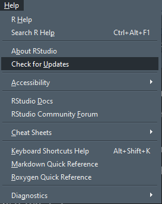

--- 
title: "R Spatial and Visualization Workshop"
author: "Ronan Hart"
date: "2023-09-08"
site: bookdown::bookdown_site
documentclass: book
bibliography: [book.bib, packages.bib]
# Welcome to the R Spatial and Visualization Workshop!
# cover-image: path to the social sharing image like images/cover.jpg
description: |
  This workshop was originally created for the Utah State University's Ecology Center's R Workshop Series
link-citations: yes
github-repo: ronanhart/R_spatial_workshop
---

```{r setup, include = FALSE}
knitr::opts_chunk$set(echo = TRUE, eval = TRUE, 
                      warning = FALSE, message = FALSE)
```

<style>
p.caption {
  font-size: 0.7em;
}
</style>

# Welcome to the R Spatial and Visualization Workshop!

(This workshop was originally created for the Utah State University's Ecology Center's R Workshop Series)

## Table of Contents {-}

**Chapter 1: Introduction and Prerequisites**

**Chapter 2: Introduction to GIS**

This chapter is recommended if you have never taken any GIS course, it is your first time working with spatial data, or you would like a refresher on the basics of GIS.

**Chapter 3: Spatial Data in R**

This chapter is recommended if you have worked with spatial data in other programs or software such as the ArcGIS suite but are unfamiliar with how to load or manipulate spatial data in R.

**Chapter 4: Spatial Analysis**

This is the meat of this workshop. This chapter goes over how to perform some spatial analyses you are likely going to use. This is not comprehensive to every possible function or analysis that one might need. 

**Chapter 5: Visualization**

Once you've performed your spatial analysis, you likely need to make some nice-looking maps to include in a manuscript or presentation. This chapter goes over some tips and tricks to make your maps a little more visually appealing, such as how to adjust the color palettes, add map elements like a north arrow and scale bar, including an inset, and more.

**Chapter 6: Conclusions and Resources**

This brief chapter offers some resources on where to find spatial data you may need in your analyses and where I obtained the data used in the workshop.

***

## Goals of this workshop: {-}

* Reiterate the basics of GIS
* Teach you the processes that you might have learned in ArcGIS or other GIS software that you can code yourself in R
* Teach you some tips and tricks to make pretty maps 

If you would like to follow along, try out some of the examples, and work on some practice exercises, go to this workshop's [github page](https://github.com/ronanhart/R_Spatial_Workshop) and download the data from the Data folder and the "worksheet" page called worksheet.R

*** 

## Notes on Updates {-}

Chapters 4 and 5 are certainly not comprehensive to every function, analysis, or option for performing spatial analysis or creating pretty maps. If you have a suggestion to something specific that either you use often or something you need to use but don't know how to do it in R, please contact me and I am happy to add it!

Please note that this workshop mainly covers how to make maps using `ggplot2` and not base R plotting. It is my goal to one day include these options as well. However, 1) I have only ever plotted and made maps with `ggplot2`, so I will first have to familiarize myself with base R plotting, which may take a bit of time; and 2) I made this in my free-time as a graduate student and now a full-time worker, so updates will happen slowly.

*** 

## Why GIS in R? {-}

You may be asking why you even need to learn how to code spatial processes in R, especially if you already know how to use ArcGIS. (Well, maybe you're not actually asking that question if you’re taking this class.) But here are a few reasons why:

* Free
  + you most often need to pay companies to use their GIS software (or be a           student to use a university's license). What happens when you're no longer a      student nor hired by a company/organization that already has a license?
* Reproducible
  + Some journals require you to publish your code alongside your manuscript
  + If you are collaborating on a project, you can easily share your methods and scripts with your collaborators. 
* Open-Source
  + company-owned software is often hidden behind a "black box" so you might not be 100% certain what a function or tool is doing. 
  + Functions in R are completely open to the public so you can be certain that a function is doing what you think it's doing
* Customizable
  + You can write your code to suit your specific problem and answer your specific questions 
  + You can write custom functions and loops so that you can repeat processes on multiple features and rasters without having to copy and paste code 

Reproducibility and customization are not unique to R but rather an advantage to using code for GIS in general. In a few weeks there will be a workshop on coding in python for GIS tools, which is just as useful (especially because you can use the package `arcpy` in python to code directly to ArcGIS), so I also recommend taking that workshop if you’re interested.

Not to say that programs such as ArcGIS should never be used. On the contrary, since it was the way I first learned GIS, I will sometimes return to it to make a map on the fly or quickly visualize and double-check a polygon or raster. All programs have their pros and cons, and this workshop is to simply add another tool in your spatial analysis toolbox. 

***

## Prerequisites, Packages, and Preparation {-}

Before we begin, please be sure you have done the follow preparations:

1. Make sure you have a recent version of [R](https://cran.r-project.org/) and [RStudio](https://www.rstudio.com/) installed
  + to check your version of R, type `R.version` in the console. `version.string` will have the version number and its release date. The most recent version (as of 2022-03-30) is 4.1.3 (released on 2022-03-10). **Version 4.1.2 is perfectly fine for this workshop.**
  + to check your version of RStudio, Go to Help (in the toolbar at the top) > Check for Updates. RStudio 2022.02.1+461 is the most recent version. **Version 2021.09.2+382 is perfectly fine for this workshop.**
  
```{r help, fig.align = 'center', out.width = '25%', echo = F}

```

2. Install (if needed) and load the following packages:

```{r installDemo, eval = F}
install.packages("terra")
install.packages("sf")
install.packages("tidyverse")
```

```{r mapsPkg, echo = F}
library(maps)
```

```{r packages00, eval = F}
library(terra)
library(sf)
library(tidyverse)
```

3. (Optional but recommended) Create a new RStudio project. This will make it easier to access files within your code and keep everything organized. [Here's a guide on how to do that](https://support.rstudio.com/hc/en-us/articles/200526207-Using-RStudio-Projects)

After taking care of that, let's get started!
